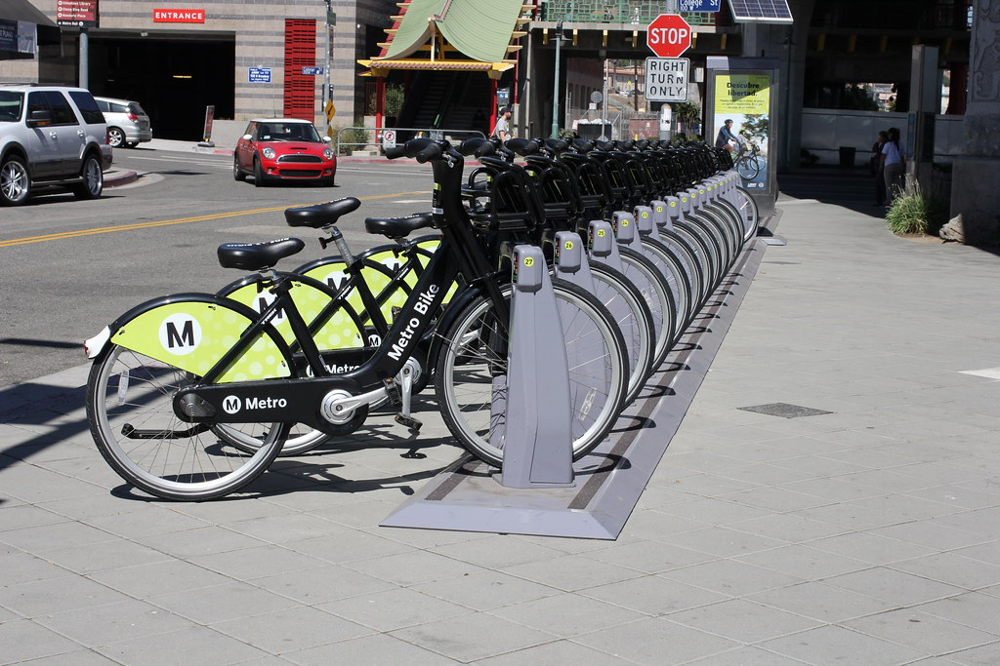

# Los Angeles Metro Bike Share

(Image from [Flickr](https://www.flickr.com/photos/vtpoly/29338093683); CC 2.0)

The Los Angeles Metropolitan Transportation Authority, or LA Metro, is one of the largest public transportation agencies in the US by population and area served. Its services cover the Los Angeles county and its 10+ million inhabitants. In the recent years, LA Metro has launched various projects to improve and promote public transit, among which Metro Bike Share (2016-present) is one of the most visible. The 1400 bikes thus installed facilitate short trips and access to transit hubs.

Given Los Angeles’ long-held reputation as a car capital, it is interesting to study the usage patterns of Metro Bike Share and see how it has gained traction despite the dominance of cars. In addition, the ongoing COVID-19 pandemic has drastically affected local budgets and, very likely, mobility patterns; the long-term survival of the Bike Share program may be in doubt.

